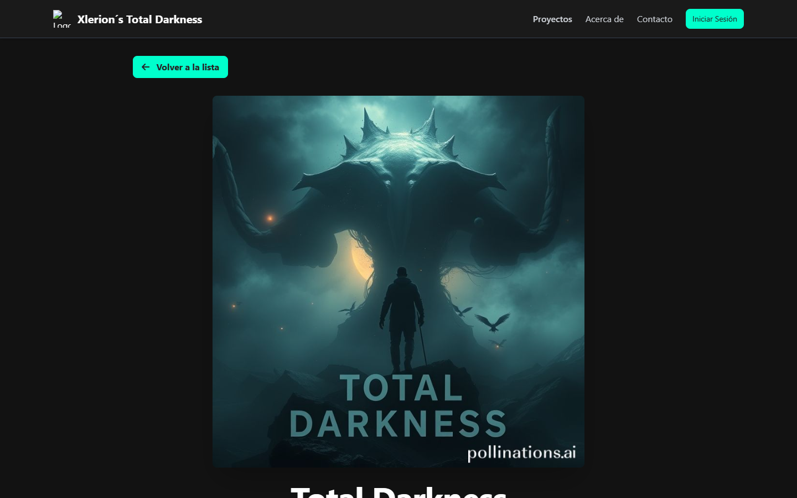
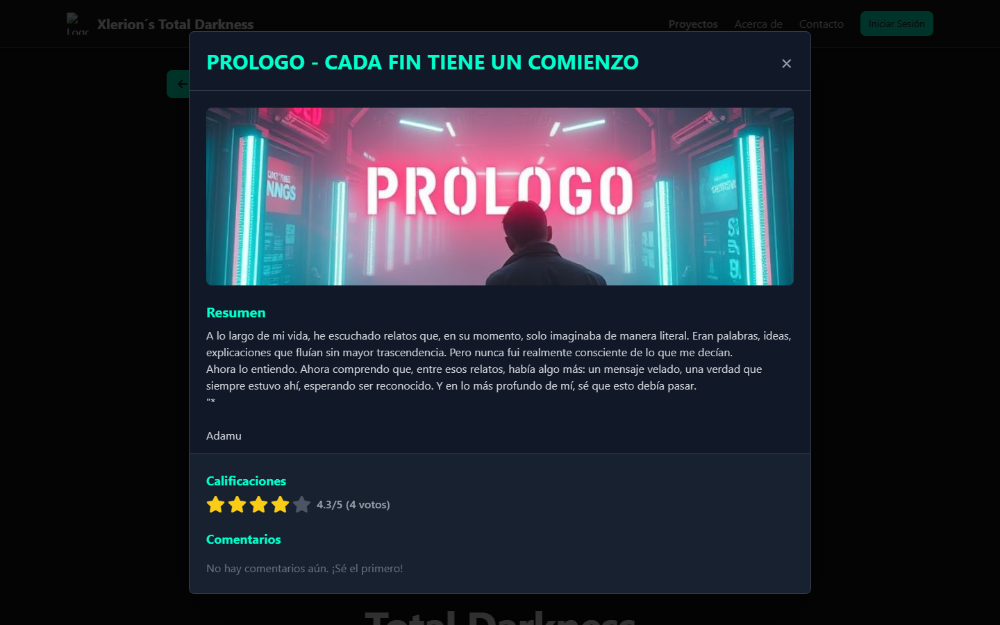
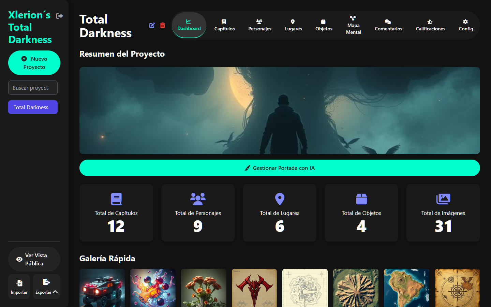

# Xlerion Story Creator

> Plataforma para crear, organizar y publicar mundos de ficción interactivos — del panel de administración a GitHub Pages en un clic.

[](https://miguelxlerion.github.io/XlerionStoryCreator/Xlerion-Total-Darkness.html)


**[▶ Ver el sitio en vivo: Total Darkness](https://miguelxlerion.github.io/XlerionStoryCreator/Xlerion-Total-Darkness.html)**

## Capturas

| Vista pública | Proyecto |
|---|---|
|  |  |

| Detalle con calificaciones | Panel de administración |
|---|---|
|  |  |

## Qué es

**Xlerion Story Creator** es un CMS ligero para escritores, guionistas y diseñadores narrativos. Consta de dos aplicaciones:

| App | Archivo | Descripción |
|---|---|---|
| **Panel de administración** | `index.html` | Crea y edita proyectos, capítulos, personajes, lugares y objetos. Dashboard con estadísticas, mapa mental, generación de imágenes con IA y publicación. |
| **Vista pública** | `Xlerion-Total-Darkness.html` | Sitio de lectura para tu audiencia: sinopsis, galerías, mapa mental, calificaciones con estrellas y comentarios. Aplica automáticamente el diseño del panel. |

## Funcionalidades

- **Gestión de contenido** — proyectos, capítulos (con orden), personajes (edad, género, físico, trasfondo), lugares (tipo, atmósfera, lore + mapa) y objetos (tipo, origen, poderes).
- **Dashboard** — contadores, galería rápida, destacados aleatorios y gráficos (edades, géneros, tipos, calificaciones promedio).
- **Mapa mental interactivo** (vis-network) generado desde tu contenido, con física ajustable.
- **Generación de imágenes con IA** — portadas, retratos, objetos y mapas. Proveedores gratuitos configurables por tarea (Pollinations.ai, Stable Diffusion, Hugging Face Inference, endpoints propios), cada uno con su API key y botón de prueba.
- **CMS de configuración** — pestaña *Config*: diseño/tema en vivo (colores, tipografía, textos de botones), prompts y estilos de IA, ajustes generales, respaldo de ajustes y despliegue.
- **Comunidad** — la audiencia califica (1–5) y comenta; el panel muestra la gestión de comentarios y calificaciones.
- **Exportación** — JSON (respaldo), PDF profesional con índice y gráficos, HTML y HTML para Kindle (KDP).
- **Publicación en GitHub Pages** — desde el panel: prueba de conexión, guardado de token en servidor y despliegue del sitio completo (`data.json`, `theme.json`, visor) con un clic.
- **PWA** — instalable y con soporte sin conexión (Service Worker con estrategia network-first para datos).

## Tecnologías

| Capa | Tecnología | Versión / detalle |
|---|---|---|
| Frontend | HTML5, CSS3, JavaScript (Vanilla, ES modules) | Sin frameworks |
| UI | Tailwind CSS (CDN), Font Awesome | `6.0.0-beta3` |
| Gráficos | Chart.js | CDN (jsdelivr) |
| Mapa mental | vis-network | UMD (unpkg) |
| PDF | jsPDF + autotable | `2.5.1` / `3.8.2` |
| Almacenamiento | IndexedDB vía `idb` + respaldo en servidor (`settings.php`) | UMD (jsdelivr) |
| Auth admin | Firebase Authentication 9.23 (opcional) + acceso local con hash SHA-256 | — |
| IA (imágenes) | Pollinations.ai, Stable Diffusion, Hugging Face Inference API | Endpoints configurables |
| Backend | PHP 8+ (`publish.php`, `update.php`, `deploy.php`, `settings.php`, `router.php`) | cURL para GitHub API |
| Despliegue | GitHub Contents API → GitHub Pages | — |
| PWA | Service Worker + `manifest.json` | — |

## Inicio rápido

### Opción A — Doble clic (Windows)

```
launcher.bat
```

Busca un puerto libre, arranca el servidor PHP, muestra el link y abre el navegador.

### Opción B — Manual

```bash
php -S localhost:5173 router.php
# Abrir http://localhost:5173/index.html  (panel)
# Abrir http://localhost:5173/Xlerion-Total-Darkness.html  (vista pública)
```

> Sin PHP también sirve como sitio estático (`python -m http.server`), pero publicar, calificar, comentar y respaldar ajustes requieren PHP.

### Acceso al panel

- **Modo local** (sin configurar nada): `admin@xlerion.local` + la contraseña de tu `.env` (`XLERION_ADMIN_PASSWORD`).
- **Modo Firebase** (opcional): completa `firebaseConfig` y `adminEmail` en `app.js` con tu proyecto de [Firebase Console](https://console.firebase.google.com).

## Configuración (`.env`)

```ini
XLERION_ADMIN_EMAIL=admin@xlerion.local
XLERION_ADMIN_PASSWORD=tu-contraseña
GITHUB_TOKEN=            # Token classic con permiso "repo" (solo servidor)
GITHUB_REPO=miguelxlerion/XlerionStoryCreator
GITHUB_BRANCH=main
```

El token también puede guardarse desde el panel (Config → Publicación); nunca se expone al navegador. Ver `config.example.php` para todas las opciones.

## Flujo de publicación

1. **Publicar (Web)** — guarda proyectos + tema en `data.json` / `theme.json` del servidor.
2. **Config → Publicación → Probar conexión** — diagnostica por capas (cURL → internet/SSL → token → repo → Pages).
3. **Publicar en GitHub** — sube datos, diseño y visor al repo; Pages reconstruye en 1–3 minutos.

## Estructura del proyecto

```
├── index.html                    # Panel de administración
├── Xlerion-Total-Darkness.html   # Vista pública
├── app.js                        # Lógica del panel + IA + export + settings
├── historia.js                   # Lógica de la vista pública
├── config-panel.js               # Pestaña Config del CMS
├── enhancements.js               # Búsqueda, respaldo, accesibilidad
├── publish.php / update.php      # API de datos y comunidad
├── deploy.php                    # Despliegue a GitHub Pages
├── settings.php / router.php     # Respaldo de ajustes + router dev
├── service-worker.js / manifest.json
├── data.json / theme.json        # Datos publicados (generados)
├── docs/screenshots/             # Capturas del README
└── launcher.bat / launch.ps1
```

## Seguridad

- Claves y tokens solo en servidor (`.env`, git-ignorados, bloqueados por `.htaccess` y `router.php`).
- Sanitización y rate-limit en `update.php`; validación y backups en `publish.php`.
- Contraseña de admin local verificada por hash SHA-256 (WebCrypto con fallback).
- Contenido de usuarios escapado (anti-XSS) en la vista pública.

## Hoja de ruta

- [ ] Editor de texto enriquecido para capítulos
- [ ] Búsqueda global y etiquetas
- [ ] Modo multi-usuario con roles
- [ ] Tests E2E (Playwright) y CI

## Licencia y autoría

Desarrollado por **XLERION STUDIOS — COLOMBIA**.
Contacto: [contactus@xlerion.com](mailto:contactus@xlerion.com) · [Twitter](https://twitter.com/XlerionUltimate) · [LinkedIn](https://www.linkedin.com/in/miguelrodriguez-dataviz/) · [Patreon](https://www.patreon.com/c/xlerion)

¿Te gusta el proyecto? Explora la historia en vivo: **[Total Darkness](https://miguelxlerion.github.io/XlerionStoryCreator/Xlerion-Total-Darkness.html)**.
